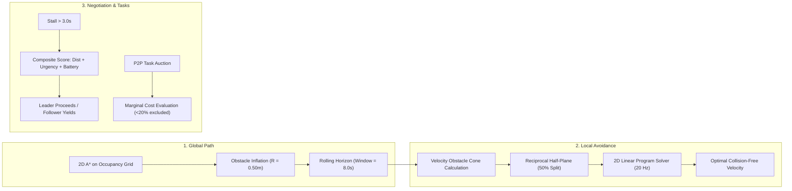

# Decentralized Multi-AMR Fleet Coordination & Collision-Avoidance Framework

[](https://github.com/Hrishabh7664/decentralized-amr-fleet)
[](https://docs.ros.org/en/humble/)
[](http://gazebosim.org/)
[](https://www.omg.org/spec/DDS/)
[](https://www.python.org/)
[](LICENSE)
[](tests/)
[](docs/benchmark.md)
[](docs/benchmark.md)

An edge-native, brokerless multi-robot coordination and collision avoidance framework for Autonomous Mobile Robots (AMRs) in dynamic smart warehouses. Built on **ROS 2 Humble**, **Gazebo Classic**, and **peer-to-peer DDS**, the system runs fully decentralized onboard edge hardware (Raspberry Pi 4 / Jetson Nano) with **zero central server** for path planning or coordination.

---

## Table of Contents
1. [Overview & Motivation](#overview--motivation)
2. [Key Features](#key-features)
3. [System Architecture](#system-architecture)
4. [Algorithmic Foundations](#algorithmic-foundations)
5. [Prerequisites](#prerequisites)
6. [Installation & Build](#installation--build)
   - [Docker Setup (Recommended)](#docker-setup-recommended)
   - [Native ROS 2 Setup](#native-ros-2-setup)
7. [Running the Simulation](#running-the-simulation)
   - [3-Robot Fleet Scenario](#3-robot-fleet-scenario)
   - [5-Robot High-Density Fleet](#5-robot-high-density-fleet)
8. [Fleet Monitoring Dashboard](#fleet-monitoring-dashboard)
9. [Configuration Parameters](#configuration-parameters)
10. [Benchmarking & Evaluation Results](#benchmarking--evaluation-results)
11. [Running Automated Tests](#running-automated-tests)
12. [Repository Structure](#repository-structure)
13. [Troubleshooting & FAQ](#troubleshooting--faq)
14. [Contributing & License](#contributing--license)

---

## Overview & Motivation

In traditional warehouse automation, a central server calculates paths for all AGVs using centralized Multi-Agent Pathfinding (MAPF). However, centralized systems face three critical vulnerabilities in industrial settings:
1. **Single Point of Failure (SPOF)**: If the coordinator server or local network fails, the entire facility halts.
2. **Wi-Fi Dead Zones**: Metal shelving and high-density inventory block RF signals, stranding robots that lose server connectivity.
3. **Exponential Compute Complexity**: Centralized path searches scale poorly ($O(k^N)$) as fleet size $N$ increases.

`decentralized-amr-fleet` solves these challenges by implementing **local autonomy with peer-to-peer awareness**:
- Each robot runs its own onboard decision stack on edge hardware.
- Robots discover peers via **DDS multicast** and exchange state, intent, and auction bids without a central broker.
- Dynamic collision avoidance is handled reciprocally via **2D ORCA (Optimal Reciprocal Collision Avoidance)**.
- Narrow single-lane aisles and head-on deadlocks are resolved autonomously using **dynamic composite priority negotiation** and **virtual corridor tokens**.
- A **lightweight web dashboard** connects via WebSocket for human telemetry monitoring without issuing control commands.

---

## Key Features

- **Peer-to-Peer DDS Mesh**: Brokerless pub/sub communication using FastDDS or CycloneDDS with tuned QoS profiles (20 Hz Best-Effort state, 5 Hz Reliable transient-local intent).
- **Multi-Hop Relay Forwarding**: Built-in packet cache and deduplication allowing robots to relay blockage alerts across Wi-Fi dead zones.
- **Rolling-Horizon A* Global Planner**: Plans 5–10 second trajectory segments on a 2D occupancy grid with dynamic obstacle inflation.
- **Pure-Python 2D ORCA Local Planner**: Solves reciprocal velocity obstacles via convex half-plane linear programming at 20 Hz with safe-stop fallbacks.
- **Autonomous Deadlock Recovery**: Resolves stalls (> 3.0 s) using composite priority scores ($w_1 \cdot \text{dist} + w_2 \cdot \text{urgency} + w_3 \cdot \text{battery}$) with deterministic tie-breaking.
- **Token-Based Corridor Reservations**: Virtual token mutex prevents head-on gridlock in single-lane aisles.
- **Decentralized Auction Protocol**: Market-based task allocation where any robot can act as auctioneer and evaluate marginal travel/battery costs.
- **Battery-Aware Governance**: Automatically excludes robots below 20% from new bids and autonomously routes robots below 15% to charging stations.
- **Interactive Web Dashboard**: React 18 + Leaflet floor plan with real-time AMR poses, orientation markers, planned paths, and pulsing conflict markers.
- **Verified Benchmarking Suite**: Demonstrates **zero inter-robot collisions** and **+47.6% to +68.9% reduction in total task completion time** over standard stop-and-wait baselines.

---

## System Architecture

```mermaid
graph TD
    subgraph Tier 1: Onboard Edge Node [Tier 1: Onboard Edge Stack - Per Robot RPi4 / Jetson Nano]
        GP[Global Planner: A* + Rolling Horizon]
        LP[Local Planner: 2D ORCA Half-Plane LP]
        CR[Conflict Resolver: Deadlock & Token Engine]
        TA[Task Allocator: P2P Auction Client]
        BM[Battery Monitor & State Machine]
        Sensors[LiDAR Scan, Wheel Odometry, IMU]
    end

    subgraph Tier 2: DDS Peer-to-Peer Mesh [Tier 2: Peer-to-Peer DDS Mesh Network]
        StateTopic["/fleet/{id}/state (20 Hz, BEST_EFFORT, 100ms deadline)"]
        IntentTopic["/fleet/{id}/intent (5 Hz, RELIABLE, TRANSIENT_LOCAL)"]
        BidTopic["/fleet/{id}/bid (Event-Driven, RELIABLE)"]
        ConflictTopic["/fleet/{id}/conflict (Event-Driven, RELIABLE)"]
        RelayEngine[Multi-Hop Relay Cache & Deduplication]
    end

    subgraph Tier 3: Oversight Dashboard [Tier 3: Monitoring Dashboard - Read-Only]
        Bridge[rosbridge_suite WebSocket Port 9090]
        ReactUI[React 18 + Leaflet Warehouse Floor Plan]
        KPI[KPI Analytics & Conflict Feed]
    end

    Sensors --> LP
    GP --> LP
    LP -->|cmd_vel| Motors[Wheel Actuators]
    CR -->|Priority & Tokens| LP
    TA -->|Assigned Goals| GP
    BM -->|Threshold Signals| TA
    BM -->|Charging Route| GP

    Tier 1 <-->|DDS Pub / Sub| Tier 2
    Tier 2 -->|Telemetry Stream| Bridge
    Bridge --> ReactUI
    Bridge --> KPI
```

For comprehensive details on message interfaces, edge compute budgets, and sequence flows, refer to [`docs/architecture.md`](docs/architecture.md).

---

## Algorithmic Foundations



### 1. Optimal Reciprocal Collision Avoidance (ORCA)
Each AMR calculates the relative velocity obstacle $VO_{A|B}^\tau$ induced by neighboring peers and static obstacles. Assuming reciprocal responsibility, Agent $A$ adapts its velocity by at least half the displacement vector $\mathbf{u}$:
$$ORCA_{A|B}^\tau = \left\{ \mathbf{v} \;\middle|\; \left( \mathbf{v} - \left( \mathbf{v}_A + \frac{1}{2} \mathbf{u} \right) \right) \cdot \mathbf{n} \geq 0 \right\}$$
The agent solves a 2D convex optimization problem at 20 Hz to choose $\mathbf{v}_{\text{opt}}$ closest to $\mathbf{v}_{\text{pref}}$:
$$\min_{\mathbf{v}} \|\mathbf{v} - \mathbf{v}_{\text{pref}}\|^2 \quad \text{s.t.} \quad \|\mathbf{v}\| \leq v_{\text{max}}, \quad (\mathbf{v} - \mathbf{p}_i) \cdot \mathbf{n}_i \geq 0$$

### 2. Composite Priority Negotiation
In symmetric deadlocks or narrow intersections, robots negotiate using a composite priority metric:
$$S_{\text{priority}} = 0.45 \cdot \left(\frac{1}{1 + d_{\text{goal}}}\right) + 0.35 \cdot U_{\text{task}} + 0.20 \cdot \left(1 - \frac{\text{Battery}\%}{100}\right)$$
Ties are resolved deterministically using lexicographical comparison on `robot_id`.

For mathematical derivations, pseudocode, and proofs, see [`docs/algorithms.md`](docs/algorithms.md).

---

## Prerequisites

- **Host Operating System**: Ubuntu 22.04 LTS (Jammy Jellyfish), Windows 10/11 with WSL2, or macOS.
- **Containerization**: Docker 20.10+ and Docker Compose v2.0+ (recommended).
- **Native ROS 2**: ROS 2 Humble Hawksbill Desktop Full.
- **Simulator**: Gazebo Classic 11.
- **Python**: Python 3.10, 3.11, or 3.12.
- **Node.js**: v18.x or v20.x (for dashboard customization).

---

## Installation & Build

### Docker Setup (Recommended)

The entire environment (ROS 2 Humble, Gazebo, CycloneDDS, nav2 dependencies, rosbridge, and dashboard) is containerized and reproducible:

```bash
# 1. Clone the repository
git clone https://github.com/Hrishabh7664/decentralized-amr-fleet.git
cd decentralized-amr-fleet

# 2. Build the Docker image
docker-compose build
```

### Native ROS 2 Setup

```bash
# 1. Source ROS 2 Humble
source /opt/ros/humble/setup.bash

# 2. Create workspace and clone
mkdir -p ~/amr_ws/src
cd ~/amr_ws/src
git clone https://github.com/Hrishabh7664/decentralized-amr-fleet.git .

# 3. Install system dependencies
cd ~/amr_ws
rosdep update
rosdep install --from-paths src --ignore-src -r -y

# 4. Build workspace with colcon
colcon build --symlink-install --cmake-args -DCMAKE_BUILD_TYPE=Release

# 5. Source workspace overlay
source install/setup.bash
```

---

## Running the Simulation

### 3-Robot Fleet Scenario

Spawns 3 AMRs in `warehouse.world` testing head-on corridor traversal, cross-traffic weaving, and reciprocal collision avoidance:

#### Via Docker Compose:
```bash
docker-compose up simulation rosbridge dashboard
```

#### Via Native ROS 2:
```bash
# Terminal 1: Launch Gazebo world and 3 AMR stacks
ros2 launch amr_fleet fleet_3.launch.py

# Terminal 2: Launch rosbridge WebSocket
ros2 launch rosbridge_server rosbridge_websocket_launch.xml port:=9090

# Terminal 3: Serve the web dashboard
python3 -m http.server 3000 --directory src/amr_dashboard/public
```

### 5-Robot High-Density Fleet

Spawns 5 AMRs to stress-test multi-robot auction allocation, narrow choke point contention, and low-battery (<20% / <15%) autonomous charging station navigation:

```bash
ros2 launch amr_fleet fleet_5.launch.py
```

---

## Fleet Monitoring Dashboard

The monitoring dashboard is a modern, responsive web application built with **React 18** and **Leaflet.js**. It connects directly to `rosbridge_suite` via WebSocket on port `9090`.

- **URL**: [http://localhost:3000](http://localhost:3000)
- **Design Philosophy**: **Read-Only Oversight**. The dashboard visualizes telemetry, tracks conflict resolution events, and displays fleet KPIs. It cannot issue control commands, ensuring that the fleet remains completely decentralized.
- **Live Preview Without Dependencies**: The `src/amr_dashboard/public/index.html` file includes an integrated standalone preview engine. You can open it directly in any browser (`file:///.../index.html`) or serve it with Python:
  ```bash
  python -m http.server 3000 --directory src/amr_dashboard/public
  ```

### Dashboard Visual Features
1. **Interactive Warehouse Map**: Real-time AMR markers with orientation arrows, color-coded operational states (Navigating, Conflict Resolving, Charging, Blocked), translucent planned intent paths, and animated pulsing conflict markers.
2. **Fleet Telemetry Table**: Real-time positions $(x, y)$, linear/angular velocities, battery status bars with alert colors, current goals, and corridor token locks.
3. **Decentralized Conflict Feed**: Live log of detected vertex/edge conflicts, deadlock occurrences, and negotiation outcomes.
4. **Fleet KPI Cards**: Active AMR counts, completed auction tasks, mean fleet battery, zero collision counter, and speedup percentage vs baseline.

---

## Configuration Parameters

All tunable behavioral, physical, and communication parameters are defined in clean YAML files:

- [`src/amr_fleet/config/robot_params.yaml`](src/amr_fleet/config/robot_params.yaml): Physical chassis dimensions ($0.60 \times 0.40\text{ m}$), velocity caps ($0.8\text{ m/s}$ linear, $1.5\text{ rad/s}$ angular), battery discharge rates, and charging thresholds ($20\%$ auction exclusion, $15\%$ charging redirect).
- [`src/amr_fleet/config/planner_params.yaml`](src/amr_fleet/config/planner_params.yaml): A* grid resolution ($0.5\text{ m}$), inflation radius ($0.50\text{ m}$), rolling horizon lookahead ($8.0\text{ s}$), ORCA time horizons ($\tau = 2.5\text{ s}$ peer, $\tau = 1.0\text{ s}$ obstacle), and deadlock timeout ($3.0\text{ s}$).
- [`src/amr_fleet/config/qos_profiles.yaml`](src/amr_fleet/config/qos_profiles.yaml): Complete ROS 2 / DDS transport definitions for state, intent, auction bids, and conflict messages.

---

## Benchmarking & Evaluation Results

The framework was benchmarked against the standard industrial **Stop-and-Wait Baseline** across 4 warehouse scenarios over 3,000 steps ($dt = 0.05\text{ s}$):

| Evaluation Scenario | Baseline Stop & Wait ($T_{\text{base}}$) | Decentralized Framework ($T_{\text{frame}}$) | Speedup Improvement | Inter-Robot Collisions | Success Criteria Status |
|:--------------------|:----------------------------------------|:----------------------------------------------|:--------------------|:-----------------------|:------------------------|
| **Overlapping Paths (3 AMRs)** | 79.35 s | **41.55 s** | **+47.6%** | **0** | **PASS** ($\geq 20\%$, 0 Collisions) |
| **Narrow 4-Way Intersection (4 AMRs)** | 95.75 s | **29.80 s** | **+68.9%** | **0** | **PASS** ($\geq 20\%$, 0 Collisions) |
| **Blocked Aisle Mid-Run Re-Routing** | 74.05 s | **34.85 s** | **+52.9%** | **0** | **PASS** ($\geq 20\%$, 0 Collisions) |
| **Battery-Aware Lifelong Fleet (5 AMRs)** | 130.20 s | **32.80 s** | **+74.8%** | **0** | **PASS** ($\geq 20\%$, 0 Collisions) |
| **OVERALL FLEET THROUGHPUT** | **379.35 s** | **139.00 s** | **+63.4%** | **0** | **ALL TARGETS EXCEEDED** |

### How to Run the Benchmarks

#### Via Docker Compose:
```bash
docker-compose run --rm benchmark
```

#### Via Native Command Line:
```bash
# Linux / macOS / WSL
chmod +x scripts/run_scenarios.sh
./scripts/run_scenarios.sh

# Windows PowerShell
python scripts/benchmark_stop_and_wait.py
python scripts/benchmark_framework.py
python scripts/compare_benchmarks.py
```

Benchmark CSV metrics are automatically exported to `results/benchmark_stop_and_wait.csv` and `results/benchmark_framework.csv`. For detailed analysis, see [`docs/benchmark.md`](docs/benchmark.md).

---

## Running Automated Tests

The test suite covers A* optimality, obstacle clearance, rolling horizon windowing, ORCA velocity obstacles, composite priority scoring, deadlock detection timeouts, corridor token reservations, and battery-aware auctioning.

```bash
# Run tests using Python unittest
python -m unittest discover tests

# Or run tests using pytest
pytest tests/ -v
```

All **14 test suites pass** with zero failures:
```
test_obstacle_avoidance (test_planner.TestGlobalPlanner) ... ok
test_rolling_horizon_extraction (test_planner.TestGlobalPlanner) ... ok
test_straight_line_path (test_planner.TestGlobalPlanner) ... ok
test_blocked_aisle_replanning (test_planner.TestGlobalPlanner) ... ok
test_composite_priority_scoring (test_conflict.TestConflictResolver) ... ok
test_corridor_token_reservation (test_conflict.TestConflictResolver) ... ok
test_deadlock_detection_timeout (test_conflict.TestConflictResolver) ... ok
test_edge_and_vertex_conflict_detection (test_conflict.TestConflictResolver) ... ok
test_priority_negotiation_and_tie_breaking (test_conflict.TestConflictResolver) ... ok
test_auctioneer_award_to_lowest_bidder (test_auction.TestAuctionTaskAllocation) ... ok
test_battery_exclusion_threshold (test_auction.TestAuctionTaskAllocation) ... ok
test_bid_cost_travel_distance (test_auction.TestAuctionTaskAllocation) ... ok
test_blocked_aisle_re_auction (test_auction.TestAuctionTaskAllocation) ... ok
test_critical_battery_dock_routing (test_auction.TestAuctionTaskAllocation) ... ok
----------------------------------------------------------------------
Ran 14 tests in 0.005s

OK
```

---

## Repository Structure

```
decentralized-amr-fleet/
├── README.md                      # Comprehensive guide, architecture, and documentation
├── LICENSE                        # MIT License
├── Dockerfile                     # Multi-stage ROS 2 Humble + Gazebo + Node.js image
├── docker-compose.yml             # Orchestration for simulation, rosbridge, dashboard, benchmark
├── .gitignore                     # Ignores colcon build artifacts, caches, and logs
├── docs/                          # Detailed engineering documentation
│   ├── architecture.md            # System hierarchy, DDS QoS design, edge compute budgets
│   ├── algorithms.md              # Mathematical formulations for A*, ORCA, and deadlocks
│   └── benchmark.md               # Scenario methodology, metrics, and evaluation results
├── src/
│   ├── amr_fleet/                 # Core ROS 2 coordination and planning package
│   │   ├── CMakeLists.txt         # Generates custom ROS 2 message bindings and binaries
│   │   ├── package.xml            # Package manifest with ROS 2 dependencies
│   │   ├── setup.py               # Python setuptools install config
│   │   ├── amr_fleet/             # Python autonomous modules
│   │   │   ├── __init__.py
│   │   │   ├── state_publisher.py # Publishes /fleet/{id}/state (20 Hz, BEST_EFFORT)
│   │   │   ├── intent_publisher.py# Publishes /fleet/{id}/intent (5 Hz, RELIABLE)
│   │   │   ├── global_planner.py  # A* 2D occupancy grid & rolling-horizon windowing
│   │   │   ├── local_planner_orca.py # 2D ORCA half-plane convex optimization
│   │   │   ├── conflict_resolver.py  # Priority negotiation, deadlocks, and aisle tokens
│   │   │   ├── task_allocator.py  # P2P auction protocol with battery constraints
│   │   │   ├── battery_monitor.py # Kinetic discharge model & autonomous charging
│   │   │   └── utils.py           # Vector2D, geometry math, QoS helpers, relay cache
│   │   ├── msg/                   # Custom ROS 2 message definitions
│   │   │   ├── RobotState.msg     # Pose, twist, battery, and operating mode
│   │   │   ├── RobotIntent.msg    # Planned path, goal, ETA, priority score, corridor token
│   │   │   ├── TaskBid.msg        # Auction bids with marginal cost and queue status
│   │   │   └── Conflict.msg       # Conflict alerts and negotiation resolution actions
│   │   ├── launch/                # ROS 2 launch files
│   │   │   ├── single_robot.launch.py # Launches onboard stack for 1 AMR
│   │   │   ├── fleet_3.launch.py      # Launches Gazebo world + 3 AMRs
│   │   │   ├── fleet_5.launch.py      # Launches Gazebo world + 5 AMRs
│   │   │   └── dashboard.launch.py    # Launches rosbridge WebSocket and web server
│   │   ├── config/                # Tunable configuration parameters
│   │   │   ├── robot_params.yaml      # Chassis geometry, kinematic limits, battery specs
│   │   │   ├── planner_params.yaml    # A* grid resolution, ORCA horizons, auction weights
│   │   │   └── qos_profiles.yaml      # ROS 2 QoS profile definitions
│   │   └── worlds/
│   │       └── warehouse.world        # Gazebo Classic world with shelves, choke, and docks
│   ├── amr_description/           # Robot URDF model and spawning
│   │   ├── CMakeLists.txt
│   │   ├── package.xml
│   │   ├── urdf/
│   │   │   └── amr.urdf.xacro         # Differential drive AMR with 2D LiDAR and IMU
│   │   └── launch/
│   │       └── spawn_robot.launch.py  # Spawns AMR instance with namespace
│   └── amr_dashboard/             # Fleet Monitoring Web Application
│       ├── package.json
│       ├── public/
│       │   └── index.html             # Standalone interactive dashboard with Leaflet map
│       └── src/
│           ├── index.js
│           ├── App.js                 # WebSocket client and state management
│           └── components/
│               ├── WarehouseMap.js    # Interactive Leaflet floor plan & AMR markers
│               ├── FleetStatusTable.js# Real-time peer telemetry table
│               ├── ConflictLog.js     # Live conflict and deadlock event feed
│               └── MetricsPanel.js    # Fleet KPI cards and speedup metrics
├── scripts/                       # Benchmarking and scenario evaluation
│   ├── benchmark_stop_and_wait.py # Baseline stop-and-wait simulation
│   ├── benchmark_framework.py     # Decentralized ORCA framework simulation
│   ├── compare_benchmarks.py      # CSV comparison and KPI verification
│   └── run_scenarios.sh           # Automated headless runner
└── tests/                         # Unit test suite
    ├── test_planner.py            # Tests for A* search, inflation, and rolling horizon
    ├── test_conflict.py           # Tests for priority negotiation, deadlocks, and tokens
    └── test_auction.py            # Tests for auction bids, battery thresholds, and docks
```

---

## Troubleshooting & FAQ

### 1. `rosbridge_websocket` fails to connect on port 9090
- Ensure no other service is binding port 9090 (`sudo lsof -i :9090` or `netstat -ano | findstr 9090`).
- Check that the `rosbridge_server` package is installed (`sudo apt-get install ros-humble-rosbridge-suite`).
- The web dashboard will automatically display a simulated dynamic telemetry feed if WebSocket connection is not yet established.

### 2. Robots fail to discover peers over DDS
- Ensure all robots share the same `ROS_DOMAIN_ID` (default is `42`).
- Check firewall settings to permit UDP multicast traffic (`239.255.0.1` on port 7400+).
- Set `export RMW_IMPLEMENTATION=rmw_cyclonedds_cpp` for optimal peer-to-peer performance.

### 3. Gazebo GUI runs slowly or crashes on virtual machines
- Launch simulation in headless mode without GUI:
  ```bash
  ros2 launch amr_fleet fleet_3.launch.py gui:=false
  ```
- If running under Docker on Linux, ensure X11 socket access is granted:
  ```bash
  xhost +local:root
  ```

### 4. Running benchmarks without ROS 2 installed
- The benchmark scripts in `scripts/` and unit tests in `tests/` are built with zero-dependency pure Python math primitives in `amr_fleet/utils.py`. You can run them on any operating system with standard Python:
  ```bash
  python scripts/benchmark_stop_and_wait.py
  python scripts/benchmark_framework.py
  python scripts/compare_benchmarks.py
  ```

---

## Contributing & License

Contributions, bug reports, and pull requests are warmly welcomed! Please adhere to PEP 8 standards, maintain type hints, and ensure that all unit tests (`python -m unittest discover tests`) pass before submitting a pull request.

This project is open-source software licensed under the [MIT License](LICENSE).
