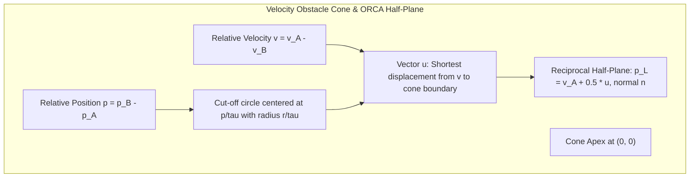
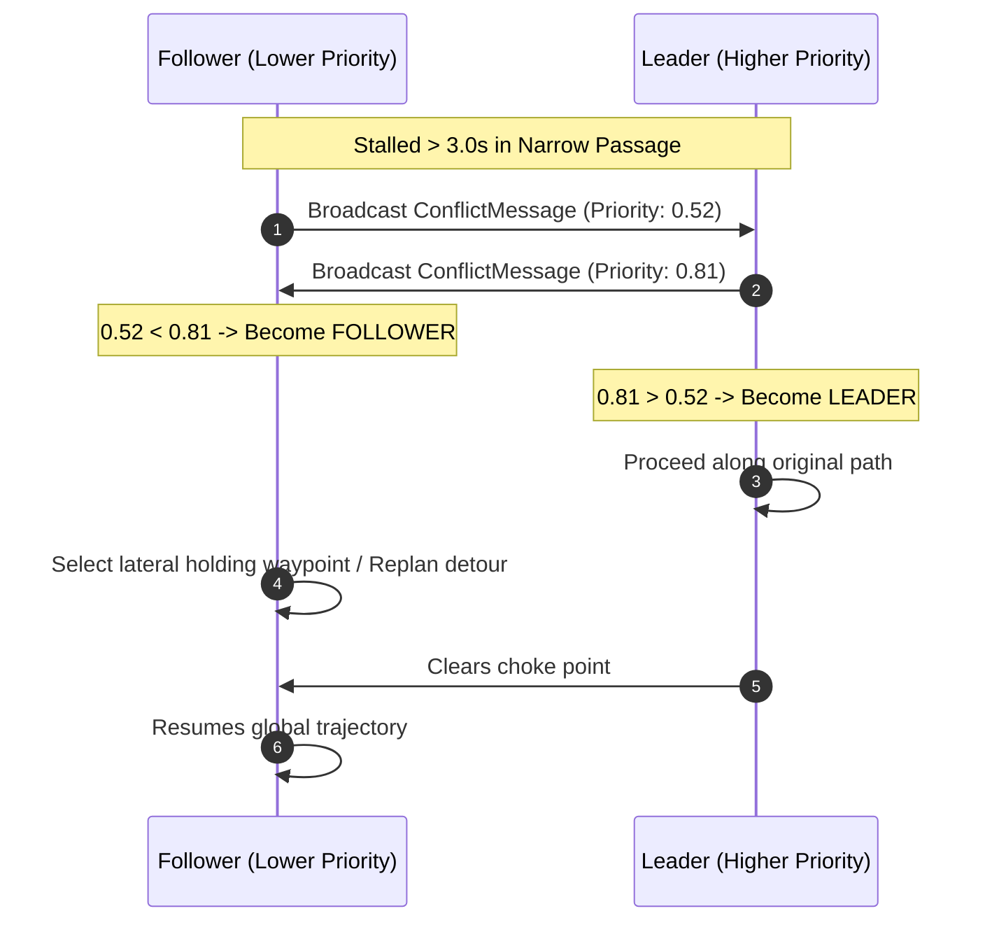
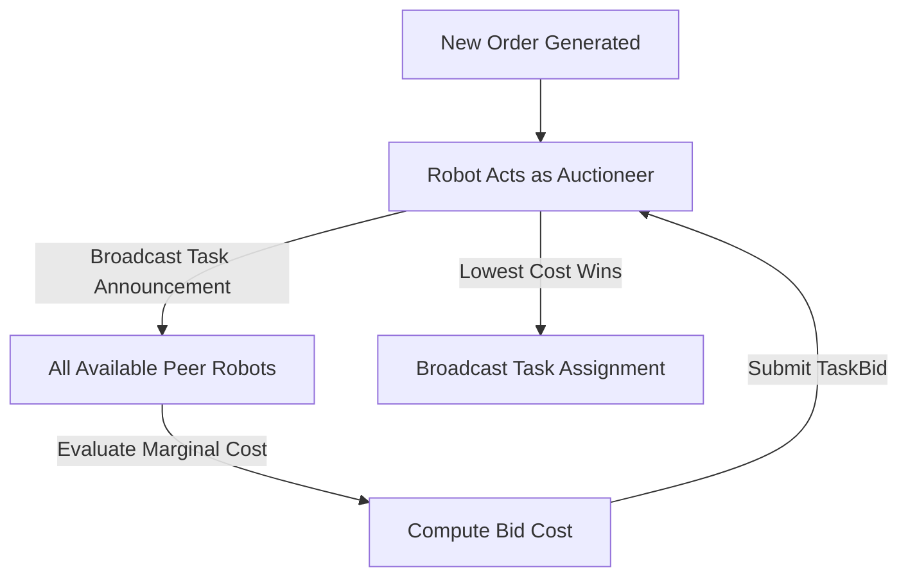

# Core Algorithmic Formulation & Mathematics

This document details the mathematical models, geometric formulations, and optimization algorithms powering the `decentralized-amr-fleet` framework.

---

## 1. Global Path Planning: A* on Occupancy Grid with Rolling Horizon

### 1.1 2D Occupancy Grid Representation
The warehouse floor is discretized into a 2D grid $\mathcal{G} \subset \mathbb{Z}^2$ with resolution $r = 0.5\text{ m/cell}$. Each cell $(g_x, g_y)$ maps to continuous metric coordinates via:
$$x = (g_x + 0.5) \cdot r + x_0, \quad y = (g_y + 0.5) \cdot r + y_0$$

### 1.2 Obstacle Inflation
To ensure differential drive robots with bounding radius $R_{\text{robot}} = 0.35\text{ m}$ navigate safely without scraping warehouse storage racks, all obstacles are inflated by:
$$R_{\text{inflation}} = R_{\text{robot}} + R_{\text{safety}} = 0.35\text{ m} + 0.15\text{ m} = 0.50\text{ m}$$
Cells within Euclidean distance $\lceil R_{\text{inflation}} / r \rceil$ of any obstacle are marked impassable.

### 1.3 Octile Distance Heuristic
For 8-connected grid motion with orthogonal step cost $1.0$ and diagonal step cost $\sqrt{2} \approx 1.4142$, the admissible and consistent heuristic $h(a, b)$ is:
$$\Delta x = |g_x^{(a)} - g_x^{(b)}|, \quad \Delta y = |g_y^{(a)} - g_y^{(b)}|$$
$$h(a, b) = \left( \Delta x + \Delta y + (\sqrt{2} - 2) \cdot \min(\Delta x, \Delta y) \right) \cdot r$$

### 1.4 Rolling Horizon Windowing
Lifelong multi-agent pathfinding in dynamic warehouses suffers from planning invalidation if paths are planned too far into the future. Instead of executing full 50-meter paths, each robot extracts a **rolling horizon** sub-path:
$$D_{\text{horizon}} = T_{\text{horizon}} \cdot v_{\text{nominal}} = 8.0\text{ s} \cdot 0.5\text{ m/s} = 4.0\text{ m}$$
The robot executes along this rolling window and continuously updates its path at $1\text{ Hz}$ or immediately upon receiving an aisle blockage alert.

---

## 2. Local Reactive Collision Avoidance: 2D ORCA

### 2.1 Velocity Obstacle (VO) Formulation
Let Robot $A$ be at position $\mathbf{p}_A$ with velocity $\mathbf{v}_A$ and radius $r_A$. Let Robot $B$ be at position $\mathbf{p}_B$ with velocity $\mathbf{v}_B$ and radius $r_B$. The combined radius is $r = r_A + r_B$.

The Velocity Obstacle $VO_{A|B}^\tau$ for time horizon $\tau$ is the set of relative velocities that lead to a collision before time $\tau$:
$$VO_{A|B}^\tau = \left\{ \mathbf{v} \in \mathbb{R}^2 \;\middle|\; \exists t \in [0, \tau], \; t \mathbf{v} \in \mathcal{D}(\mathbf{p}_B - \mathbf{p}_A, r) \right\}$$
where $\mathcal{D}(\mathbf{p}, r)$ is a disc centered at $\mathbf{p}$ with radius $r$.

### 2.2 Reciprocal Split
In pure reciprocal collision avoidance, both robots are assumed to make equal efforts to avoid collision. The vector $\mathbf{u}$ is defined as the smallest vector from the current relative velocity $(\mathbf{v}_A - \mathbf{v}_B)$ to the boundary of $VO_{A|B}^\tau$:
$$\mathbf{u} = \left( \arg\min_{\mathbf{w} \in \partial VO_{A|B}^\tau} \|\mathbf{w} - (\mathbf{v}_A - \mathbf{v}_B)\| \right) - (\mathbf{v}_A - \mathbf{v}_B)$$

Let $\mathbf{n}$ be the unit normal vector pointing outward from the boundary of $VO_{A|B}^\tau$ at $(\mathbf{v}_A - \mathbf{v}_B) + \mathbf{u}$. Robot $A$ adapts its velocity by at least $\frac{1}{2} \mathbf{u}$:
$$ORCA_{A|B}^\tau = \left\{ \mathbf{v} \in \mathbb{R}^2 \;\middle|\; \left( \mathbf{v} - \left( \mathbf{v}_A + \frac{1}{2} \mathbf{u} \right) \right) \cdot \mathbf{n} \geq 0 \right\}$$

### 2.3 Static Obstacles
For static obstacles (walls, racks), the obstacle is stationary ($\mathbf{v}_B = \mathbf{0}$) and cannot reciprocate. Robot $A$ assumes **100% of the responsibility**:
$$ORCA_{A|\mathcal{O}}^\tau = \left\{ \mathbf{v} \in \mathbb{R}^2 \;\middle|\; \left( \mathbf{v} - (\mathbf{v}_A + \mathbf{u}) \right) \cdot \mathbf{n} \geq 0 \right\}$$

### 2.4 2D Linear Programming Optimization
At each control step ($20\text{ Hz}$), the robot determines the optimal velocity $\mathbf{v}_{\text{new}}$ that minimizes deviation from its preferred velocity $\mathbf{v}_{\text{pref}}$ while satisfying all ORCA half-plane constraints:

$$\min_{\mathbf{v} \in \mathbb{R}^2} \|\mathbf{v} - \mathbf{v}_{\text{pref}}\|^2$$
$$\text{subject to: } \|\mathbf{v}\| \leq v_{\text{max}}$$
$$(\mathbf{v} - \mathbf{p}_i) \cdot \mathbf{n}_i \geq 0, \quad \forall i \in \{1, \dots, M\}$$

This 2D linear program is solved incrementally in $O(M)$ expected time using Seidel's randomized linear programming algorithm implemented in pure Python.

### 2.5 Safe-Stop Fallback
If the feasible region formed by the half-planes is empty (e.g. dense multi-robot choke), the solver activates the safe-stop routine:
1. Tests if $\mathbf{v} = (0, 0)$ satisfies minimum collision time.
2. If safe, brakes to zero velocity.
3. Signals the **Conflict Resolver** to initiate priority negotiation.

---

## 3. Conflict Resolution & Deadlock Handling

While ORCA guarantees collision avoidance, symmetric head-on encounters in narrow aisles can cause **reciprocal deadlocks** (both robots stop or oscillate).

### 3.1 Conflict Classification
1. **Edge Conflict**: Two robots traverse the same corridor edge in opposite directions ($\mathbf{v}_A \cdot \mathbf{v}_B < -0.7$).
2. **Vertex Conflict**: Two robots' planned trajectories place them within $0.8\text{ m}$ at the same timestamp.
3. **Deadlock**: An AMR maintains speed $\|\mathbf{v}\| < 0.05\text{ m/s}$ for $> 3.0\text{ s}$ while distant from its goal and interacting with nearby peers.

### 3.2 Dynamic Composite Priority Scoring
When a deadlock or intersection contention is detected, robots calculate their composite priority score:

$$S_{\text{priority}} = w_{\text{dist}} \cdot \left(\frac{1}{1 + d_{\text{goal}}}\right) + w_{\text{urgency}} \cdot U_{\text{task}} + w_{\text{bat}} \cdot \left(1 - \frac{\text{Battery}\%}{100}\right)$$

Default weights:
- $w_{\text{dist}} = 0.45$: Closer robots receive higher priority, clearing intersections faster.
- $w_{\text{urgency}} = 0.35$: Critical order retrieval tasks take precedence.
- $w_{\text{bat}} = 0.20$: Prevents low-battery robots from being starved of movement.

**Deterministic Tie-Breaking**: If $|S_A - S_B| < 10^{-4}$, the robot with the lexicographically smaller ID wins:
$$\text{Winner} = \begin{cases} A, & \text{if } S_A > S_B \text{ or } (S_A = S_B \land \text{id}_A < \text{id}_B) \\ B, & \text{otherwise} \end{cases}$$

### 3.3 Negotiation Protocol: Leader-Yield / Follower-Replan

### 3.4 Narrow Corridor Virtual Token Reservation
For single-lane aisles where two robots cannot pass each other simultaneously:
- Each single-lane segment has a virtual token identifier (e.g., `corridor_main`).
- Approaching robots broadcast a token request.
- The first arriving robot acquires the token; other robots wait at designated exterior holding points.
- Once the holding robot exits the corridor bounding box, the token is released.

---

## 4. Decentralized Task Allocation & Battery Management

### 4.1 Peer-to-Peer Auction Protocol
Any AMR that generates or receives a customer order acts as the temporary **auctioneer**.

### 4.2 Marginal Cost Evaluation
Each peer evaluates its marginal bid cost:
$$\text{Cost} = w_1 \cdot T_{\text{travel}} + w_2 \cdot \left(1 - \frac{\text{Battery}\%}{100}\right) \cdot 100 + w_3 \cdot N_{\text{queue}} \cdot 15.0 + w_4 \cdot C_{\text{congestion}}$$

- $T_{\text{travel}} = (\|\mathbf{p}_{\text{curr}} - \mathbf{p}_{\text{pickup}}\| + \|\mathbf{p}_{\text{pickup}} - \mathbf{p}_{\text{dropoff}}\|) / v_{\text{nominal}}$
- $N_{\text{queue}}$: Number of pending tasks in robot queue.
- $C_{\text{congestion}}$: Congestion factor along the estimated corridor.

### 4.3 Battery-Aware Rules
- **Below 20%**: Excluded from participating in new task auctions unless marked emergency ($U \geq 0.9$).
- **Below 15%**: Critical battery state. The robot autonomously cancels its current task, triggers a **re-auction** for other robots to adopt the order, plans an A* route to the nearest vacant charging dock, and broadcasts a `ChargingIntent` message.
