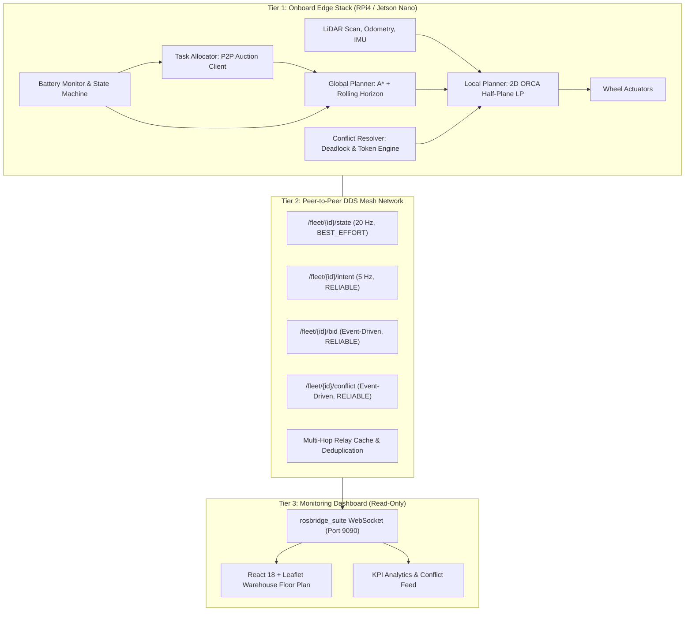
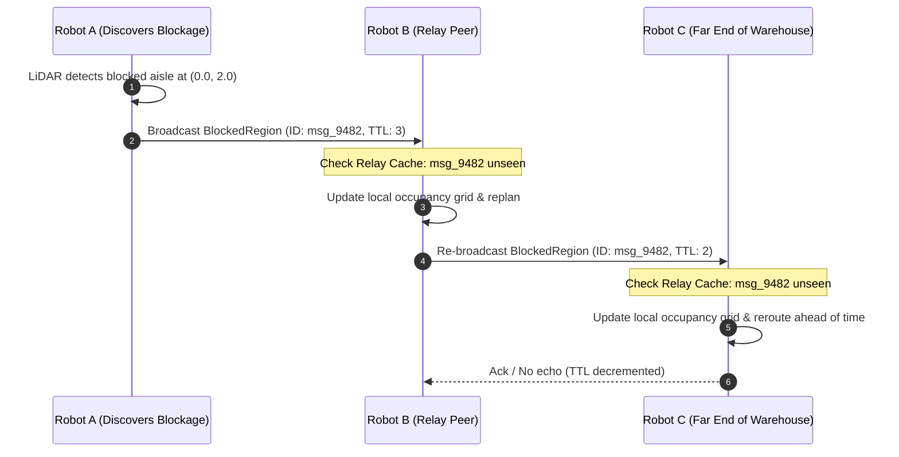

# System Architecture: Decentralized Multi-AMR Fleet

## 1. Overview and Core Philosophy

The `decentralized-amr-fleet` framework is an edge-native, brokerless multi-robot coordination system designed for dynamic industrial smart warehouses. Traditional automated guided vehicle (AGV) and autonomous mobile robot (AMR) fleets rely on a central fleet management server that computes centralized Multi-Agent Pathfinding (MAPF) plans. While centralized coordination works in static, small environments, it introduces critical liabilities:
- **Single Point of Failure (SPOF)**: Server crashes halt the entire facility.
- **Wi-Fi Dead-Zone Fragility**: Packet loss or signal attenuation in metallic shelving aisles disconnects robots from the central server.
- **Compute Scalability Bottlenecks**: Solving lifelong MAPF centrally scales exponentially ($O(k^N)$) as fleet size $N$ grows.

This framework replaces the central coordinator with a **fully decentralized, peer-to-peer paradigm**:
$$\text{Local Autonomy} + \text{Peer Awareness} = \text{Global Fleet Efficiency}$$

Every robot runs an autonomous decision-making loop on onboard edge hardware (Raspberry Pi 4 or Jetson Nano), broadcasts its telemetry and intent over DDS (Data Distribution Service), and negotiates conflicts directly with neighboring peers.

---

## 2. Three-Tier Architectural Hierarchy

### Tier 1: Onboard Edge Compute
Runs locally on each AMR. Includes:
- **Global Path Planning**: Static obstacle avoidance via 2D occupancy grid A* with rolling-horizon windowing (5–10 s lookahead).
- **Local Reactive Planning**: 2D Optimal Reciprocal Collision Avoidance (ORCA) convex half-plane optimization at 20 Hz.
- **Conflict & Deadlock Resolution**: Peer negotiation engine combining composite priority scoring and single-lane token reservations.
- **Task Auction Engine**: Decentralized market-based task bidding with marginal cost computation.
- **Battery Management**: Continuous discharge monitoring with autonomous threshold policies (<20% bid exclusion, <15% charging routing).

### Tier 2: Peer-to-Peer DDS Transport Mesh
- Realized through ROS 2 Humble using CycloneDDS or FastDDS.
- Zero central message broker: AMRs communicate directly via UDP multicast peer discovery.
- Edge nodes automatically discover new peers entering their communication radius (30–50 m indoors).
- **Multi-Hop Relay**: When an AMR detects a blocked aisle or critical corridor status, it broadcasts a packet that neighboring peers forward across network gaps using deduplication caches.

### Tier 3: Telemetry Monitoring Dashboard
- Strictly **read-only human oversight**.
- Connects via WebSocket to `rosbridge_suite` on port 9090.
- Does **not** issue paths, commands, or centralized control directives. If the dashboard or network bridge disconnects, the fleet operates autonomously without interruption.

---

## 3. Communication Topic Architecture & QoS Profiles

Selecting the appropriate Quality of Service (QoS) is paramount in wireless industrial robotics. High-frequency telemetry streams over lossy Wi-Fi must tolerate dropped packets without stalling the real-time control thread, while negotiation events must guarantee delivery.

| Topic Pattern | Type | Frequency | Reliability | Durability | History / Depth | Deadline | Purpose |
|:--------------|:-----|:----------|:------------|:-----------|:----------------|:---------|:--------|
| `/fleet/{id}/state` | `RobotState.msg` | 20 Hz | `BEST_EFFORT` | `VOLATILE` | Keep Last (5) | 100 ms | Real-time pose $(x, y, \theta)$, twist $(v_x, v_y, \omega)$, battery %, operating mode |
| `/fleet/{id}/intent` | `RobotIntent.msg` | 5 Hz (on change) | `RELIABLE` | `TRANSIENT_LOCAL` | Keep Last (10) | None | Planned waypoints, goal, ETA, priority score, corridor token status |
| `/fleet/{id}/bid` | `TaskBid.msg` | Event-driven | `RELIABLE` | `VOLATILE` | Keep Last (50) | None | Decentralized auction bids containing marginal cost and queue status |
| `/fleet/{id}/conflict` | `Conflict.msg` | Event-driven | `RELIABLE` | `VOLATILE` | Keep Last (50) | None | Deadlock alerts, leader-yield coordination, token acquisition |
| `/fleet/blocked_aisles`| `std_msgs/String` | Event-driven | `RELIABLE` | `TRANSIENT_LOCAL` | Keep Last (20) | None | Multi-hop broadcast of blocked warehouse aisles with bounding coords |

### Why `BEST_EFFORT` for Telemetry?
A 200 Hz string stream over Wi-Fi to a Raspberry Pi achieves only ~75% delivery under industrial RF interference. If `RELIABLE` QoS is mistakenly used for 20 Hz pose streams, TCP-like packet retransmission buffers fill up, causing buffer bloat and stale position data (latency > 500 ms). `BEST_EFFORT` ensures only fresh, current poses are consumed, and stale frames are dropped immediately.

### Why `TRANSIENT_LOCAL` for Intent?
`TRANSIENT_LOCAL` allows DDS publishers to retain the latest intent message in memory. When a robot turns into a new aisle or powers on, it immediately receives the active intents of all existing peers without waiting for their next periodic publish cycle.

---

## 4. Multi-Hop Relay & Mesh Forwarding

Industrial warehouses contain metal shelving and dense concrete pillars that create Wi-Fi dead zones. To prevent coordination blackouts, every AMR includes a `MessageRelayCache`:

1. Each broadcast message includes a unique `message_id` and a Time-To-Live (`TTL = 3`).
2. When a node receives a broadcast, it checks its LRU cache.
3. If unseen, the message is processed, cached with a 10.0-second expiration, decremented (`TTL - 1`), and forwarded to neighboring peers.
4. If already seen or `TTL == 0`, the packet is dropped, preventing broadcast storms.

---

## 5. Edge Hardware Compute Budget

The software stack is engineered to run comfortably within the power and compute envelopes of edge platforms:

| Component | Target Frequency | CPU Utilization (RPi 4, 4-core Cortex-A72) | CPU Utilization (Jetson Nano, 4-core Cortex-A57) | Max Execution Latency |
|:----------|:-----------------|:--------------------------------------------|:-------------------------------------------------|:----------------------|
| DDS Transport & Serializer | 20 Hz | 10 – 14% | 8 – 12% | < 5 ms |
| ORCA Local Planner (LP2 Solver) | 20 Hz | 18 – 26% | 14 – 20% | < 8 ms |
| A* Global Planner (Rolling Window) | 1 – 5 Hz (on change) | 12 – 18% | 10 – 15% | < 12 ms |
| Conflict Detection & Negotiation | 5 Hz | 4 – 7% | 3 – 5% | < 3 ms |
| Task Allocator & Bidding | Event-driven | < 3% | < 2% | < 2 ms |
| Battery Monitor & State Machine | 2 Hz | < 1% | < 1% | < 1 ms |
| **Total System Utilization** | — | **45 – 66%** | **36 – 54%** | **Real-Time Deterministic** |

The system operates with **> 30% headroom**, leaving ample resources for sensor drivers and scan matching localization without frame drops.
